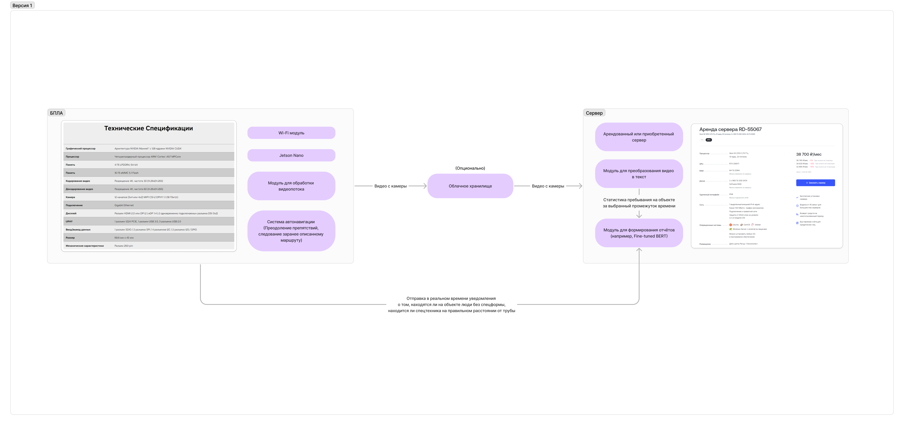

# Videoanalytics in infrastructure

>Это база знаний, сделанная с помощью [obsidian.md](https://obsidian.md/).

## Навигация:
[Articles](articles.md) - список статей и источников.  
[Books](books.md) - список книг, связанных с поставленной задачей.       
[Concept](concept.md) - описание постановки задачи, целей и требований к системе.    
[Technologies](technologies.md) - список технологий, которые будут использоваться для решения задач.  
[Architecture](https://www.figma.com/board/WqUqIrm5pdnPOcZC41cODF/videoanalytics-in-infrastructure) - наброски по архитектуре системы.    
[Datasets](datasets.md) - список датасетов, которые можно использовать для решения задачи.  

## Архитектура

