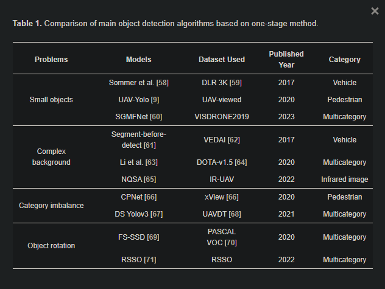
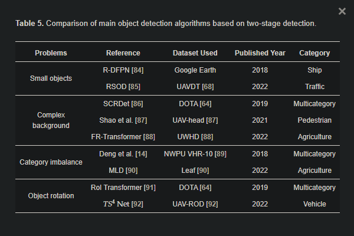

## На рассмотрение
* [Drone Navigation and License Place Detection for Vehicle Location in Indoor Spaces](https://link.springer.com/chapter/10.1007/978-3-031-49552-6_31)
* [Research on improved YOLOv8 algorithm for insulator defect detection](https://link.springer.com/article/10.1007/s11554-023-01401-9)
* [Beyond SOT: Tracking Multiple Generic Objects at Once](https://research.google/pubs/beyond-sot-tracking-multiple-generic-objects-at-once/)
* [Siamese object tracking for unmanned aerial vehicle: a review and comprehensive analysis](https://link.springer.com/article/10.1007/s10462-023-10558-5)
* [Online Multi-Object Tracking Under Moving Unmanned Aerial Vehicle Platform Based on Object Detection and Feature Extraction Network](https://link.springer.com/article/10.1007/s12204-022-2540-4)
* [Improved YOLOX-X based UAV aerial photography object detection algorithm](https://www.sciencedirect.com/science/article/pii/S0262885623000719)
* [Optimized deep learning vision system for human action recognition from drone images](https://link.springer.com/article/10.1007/s11042-023-15930-9)
* [Active Learning for Single-Stage Object Detection in UAV Images](https://openaccess.thecvf.com/content/WACV2024/html/Yamani_Active_Learning_for_Single-Stage_Object_Detection_in_UAV_Images_WACV_2024_paper.html)
* [Lightweight UAV Object-Detection Method Based on Efficient Multidimensional Global Feature Adaptive Fusion and Knowledge Distillation](https://www.mdpi.com/2079-9292/13/8/1558)
* [Early Drought Detection in Maize Using UAV Images and YOLOv8+](https://www.mdpi.com/2504-446X/8/5/170)
* [Narrative Action Evaluation with Prompt-Guided Multimodal Interaction](https://arxiv.org/abs/2404.14471)
* [Implementation of Intelligent Indoor Service Robot Based on ROS and Deep Learning](https://www.mdpi.com/2075-1702/12/4/256)
* [LO-Det: Lightweight Oriented Object Detection in Remote Sensing Images](https://arxiv.org/abs/2209.07709)
* [PVswin-YOLOv8s: UAV-Based Pedestrian and Vehicle Detection for Traffic Management in Smart Cities Using Improved YOLOv8](https://www.mdpi.com/2504-446X/8/3/84)
* [ITD-YOLOv8: An Infrared Target Detection Model Based on YOLOv8 for Unmanned Aerial Vehicles](https://www.mdpi.com/2504-446X/8/4/161)
* [Improved YOLOv7 Target Detection Algorithm Based on UAV Aerial Photography](https://www.mdpi.com/2504-446X/8/3/104)
* [HRYNet: A Highly Robust YOLO Network for Complex Road Traffic Object Detection](https://www.mdpi.com/1424-8220/24/2/642)
* [GA-Net: Accurate and Efficient Object Detection on UAV Images Based on Grid Activations](https://www.mdpi.com/2504-446X/8/3/74)
* [Improved YOLOv7 Algorithm for Small Object Detection in Unmanned Aerial Vehicle Image Scenarios](https://www.mdpi.com/2076-3417/14/4/1664)
* [Real-Time Detection and Analysis of Vehicles and Pedestrians using Deep Learning](https://arxiv.org/pdf/2404.08081)
* [An oil and gas pipeline inspection UAV based on improved YOLOv7](https://journals.sagepub.com/doi/full/10.1177/00202940241230426)
* [Vehicle Detection From UAV Imagery With Deep Learning: A Review](https://ieeexplore.ieee.org/abstract/document/9439930)

## Рассмотрено
### [A Survey of Object Detection for UAVs Based on Deep Learning / Обзор методов обнаружения объектов для БПЛА на основе глубокого обучения {2024}](https://www.mdpi.com/2072-4292/16/1/149)
**Краткая информация:**
В статье рассматриваются основные методы для решения задач распознавания объектов через снимки БПЛА с различными условиями: распознавание объектов при наличии сложного фона, распознавание маленьких объектов, распознавание объектов при дисбалансе категорий, распознавание объектов с разной ориентацией на снимках.
Также приведен список публичных датасетов с их описаниями.

### [Transformers in Small Object Detection: A Benchmark and Survey of State-of-the-Art / Трансформеры в обнаружении маленьких объектов {2023}](https://paperswithcode.com/paper/transformers-in-small-object-detection-a)
**Краткая информация:**
Обзорная статья 60 исследований (2020-2023), связанных с задачами обнаружения малых объектов на изображениях. Рассматриваются следующие приложения: обнаружение малых объектов в общих изображениях, аэрофотоснимках, медицинских изображениях и подводных изображениях.
### [Enhancing UAV Aerial Image Analysis: Integrating Advanced SAHI Techniques with Real-Time Detection Models on the VisDrone Dataset {2024}](https://www.researchgate.net/publication/378055012_Enhancing_UAV_Aerial_Image_Analysis_Integrating_Advanced_SAHI_Techniques_with_Real-Time_Detection_Models_on_the_VisDrone_Dataset)
**Краткая информация:**
*Метод не включен в [Technologies](technologies.md), т.к. в статье не указан репозиторий.* 
В данной статье предлагается подход, интегрирующий модель RT-DETR-X с фреймворком Slicing Aided Hyper Inference (SAHI), что позволило значительно улучшить точность обнаружения малых объектов на изображениях датасета VisDrone-DET, хотя и за счет увеличения вычислительного времени. SAHI работает путем разделения исходного изображения на перекрывающиеся блоки или срезы, что позволяет увеличить площадь пикселей малых целевых объектов, делая их более различимыми для алгоритмов обнаружения. После процесса инференции результаты из этих срезов тщательно восстанавливаются, используя методы, такие как Non-Maximum Suppression (NMS) и Intersection over Smaller Area (IOS) или Intersection over Union (IoU), для обеспечения тщательного покрытия всей площади изображения и снижения риска пропуска обнаружений по краям срезов.
![[article_2_1.png]]
### [Deep learning for unmanned aerial vehicles detection: A review {2023}](https://www.sciencedirect.com/science/article/pii/S1574013723000813#sec1)
**Краткая информация:**
Данная статья проводит многосторонний анализ особенностей использования дронов (в т.ч. безопасность и приватность), рассматриваются факторы, влияющие на производительность дронов, а также предоставляется краткий обзор методов глубокого обучения на основе различных подходов. Методы разделены на четыре категории: визуальные, радарные, акустические и радиочастотные подходы, причём указаны преимущества и недостатки каждой из категорий.
![[article_3_1.png]]
### [Advances in Computer Vision-Based Civil Infrastructure Inspection and Monitoring {2018}](https://www.researchgate.net/publication/331565675_Advances_in_Computer_Vision-Based_Civil_Infrastructure_Inspection_and_Monitoring)
**Краткая информация:**
Статья, в которой исследуется целесообразность использования методов на основе компьютерного зрения в сочетании с удаленными камерами и БПЛА для задач мониторинга объектов гражданской инфраструктуры (мосты, дороги и др. протяженные объекты), представлено сравнение с традиционными методами. Рассмотрены потенциальные вызовы, подчеркивается перспективность использования сочетание БПЛА + CV для задач инспекции и мониторинга объектов гражданской инфраструктуры.
### [ИНТЕЛЛЕКТУАЛЬНАЯ СИСТЕМА КОМПЬЮТЕРНОГО ЗРЕНИЯ БЕСПИЛОТНЫХ ЛЕТАТЕЛЬНЫХ АППАРАТОВ ДЛЯ МОНИТОРИНГА ТЕХНОЛОГИЧЕСКИХ ОБЪЕКТОВ ПРЕДПРИЯТИЙ НЕФТЕГАЗОВОЙ ОТРАСЛИ {2019}](https://izvestiya.tpu.ru/archive/article/view/2346)
**Краткая информация:**
В этой статье предлагается система для мониторинга в реальном времени на борту БПЛА технологических объектов и прилегающих к ним территорий; был разработан полный программный комплекс со своим кодировщиком-декодировщиком и методом компьютерного зрения на основе tiny-YOLO (модель, близкая к YOLOv2).

## Взято как источник
...
