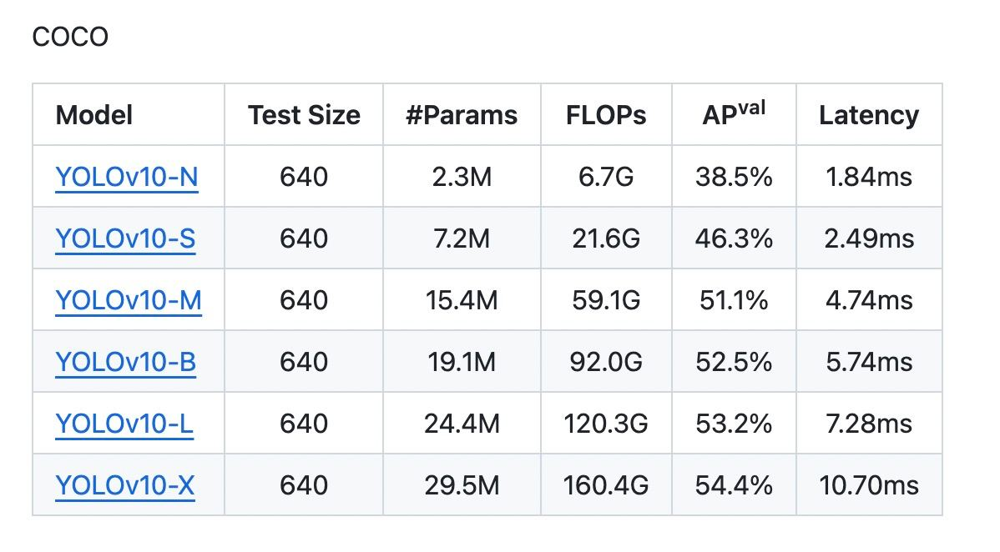

## Модели для распознавания объектов:
### SCRDet {2019}
**Краткое описание:**     
Двухэтапная модель, основанная на R2CNN, для обнаружения сверхмалых объектов на изображениях.       
**Ссылки:**
* [Paper](https://arxiv.org/abs/1811.07126v4)
* [GitHub](https://github.com/DetectionTeamUCAS/R2CNN-Plus-Plus_Tensorflow)
* [PapersWithCode](https://paperswithcode.com/paper/r2cnn-multi-dimensional-attention-based)

### SCRDet++ {2020}  
**Краткое описание:**   
Улучшенная версия SCRDet (модели, на основе RetinaNet) для обнаружения небольших объектов в загроможденных кадрах.      
**Ссылки:**  
- [Paper](https://arxiv.org/abs/2004.13316) (233 citates)
- [GitHub](https://yangxue0827.github.io/SCRDet++.html) (770 stars)
- [PapersWithCode](https://paperswithcode.com/paper/scrdet-detecting-small-cluttered-and-rotated)

### TPH-YOLOv5 {2021}
**Краткое описание:**     
Улучшенная с помощью Transformer Prediction Head версия YOLOv5.     
**Ссылки:**
- [GitHub](https://github.com/cv516Buaa/tph-yolov5) (699 stars)
- [Paper](https://openaccess.thecvf.com/content/ICCV2021W/VisDrone/html/Zhu_TPH-YOLOv5_Improved_YOLOv5_Based_on_Transformer_Prediction_Head_for_Object_ICCVW_2021_paper.html) (772 citates)
- [PapersWithCode](https://paperswithcode.com/paper/tph-yolov5-improved-yolov5-based-on)

### UAV-YOLOv3-CPP {2023}
**Краткое описание:**     
...     
**Ссылки:**
- [GitHub](https://github.com/Gitsuxd/UAV-Yolov3-SPP) (2 stars)
- [Paper](https://link.springer.com/content/pdf/10.1007/s40430-023-04343-2.pdf) (1 citate)

### SlimYOLOv3 {2019}
**Краткое описание:**     
Облегченная за счет SPP модуля одноэтапная модель на основе YOLOv3.    
**Ссылки:**
- [GitHub](https://paperswithcode.com/paper/slimyolov3-narrower-faster-and-better-for) (1140 stars)
- [Paper](https://link.springer.com/content/pdf/10.1007/s40430-023-04343-2.pdf) (1 citate)
- [PapersWithCode](https://paperswithcode.com/paper/slimyolov3-narrower-faster-and-better-for)

### HIC-YOLOv5 {2023}
**Краткое описание:**   
Улучшенная с помощью механизма внимания (CBAM), small object detection head, channel feature fusion with involution YOLOv5 для распознавания объектов с БПЛА на высоте 5-120m.       
**Ссылки:**
* [Paper](https://arxiv.org/abs/2309.16393) (7 citates)
* [GitHub](https://github.com/aash1999/yolov5-cbam/tree/master) (5 stars)

### ARF-YOLOv8 {2024}
**Краткое описание:**    
...     
**Ссылки:**
* [Paper](https://link.springer.com/content/pdf/10.1007/s11554-024-01483-z.pdf) (0 citates)
* [GitHub](https://github.com/sbzeng/ARF-YOLOv8-for-uav) (1 stars)

### YOLOX-X {2022}
**Краткое описание:**   
Улучшенная версия модели YOLOX (основана на YOLOv4), подходящая под задачи распознавания объектов на высоте около 125 метров.    
**Доступность:**   
The data that support the findings of this study are available from the corresponding author, Ning He, upon reasonable request.     
**Ссылки:**  
* [Paper](https://www.researchgate.net/publication/364418427_Improved_YOLOX-X_based_UAV_aerial_photography_object_detection_algorithm)

### PP-YOLOE-R {2022}
**Краткое описание:**     
...     
**Ссылки:**
- [PapersWithCode](https://paperswithcode.com/paper/pp-yoloe-r-an-efficient-anchor-free-rotated)
- [Paper](https://arxiv.org/pdf/2211.02386v1.pdf)
- [GitHub 1](https://github.com/PaddlePaddle/Paddle) (21.7k+ stars)
- [GitHub 2](https://github.com/PaddlePaddle/PaddleDetection) (12.2k+ stars)

### PVswin-YOLOv8s {2024}
**Краткое описание:**   
Улучшенная версия YOLOv8s для распознавания пешеходов и автомобилей со снимков дрона, снятых на высоте до 125 метров.     
**Доступность:**      
The data presented in this study are available on request from the corresponding author.     
**Ссылки:**
- [Paper](https://www.mdpi.com/2504-446X/8/3/84)

### YOLOv9 {2024}
**Краткое описание:**   
Улучшенная за счет внедрения новой концепции обобщенной эффективной агрегации слоев (ELAN -> GELAN) версия YOLOv7.     
**Ссылки:**
* [Ultralytics Page](https://docs.ultralytics.com/models/)
* [Paper](https://arxiv.org/abs/2402.13616v2)
* [GitHub](https://github.com/WongKinYiu/yolov9)
* [What is YOLO? The Ultimate Guide 2024](https://blog.roboflow.com/guide-to-yolo-models/) 

### YOLOv10 {2024}
**Краткое описание:**    
Новейшая модель в семействе YOLO.      
      
**Ссылки:**
* [Ultralytics Page](https://docs.ultralytics.com/models/)
* [Paper](https://arxiv.org/abs/2405.14458v1)
* [GitHub](https://github.com/THU-MIG/yolov10)
* [What is YOLO? The Ultimate Guide 2024](https://blog.roboflow.com/guide-to-yolo-models/) 

## Модели для сегментации объектов:
### FlowSAM
**Краткое описание:**    
Инструмент для обнаружения и сегментации движущихся объектов на видео.      
**Ссылки:**
- [Project Page](https://www.robots.ox.ac.uk/~vgg/research/flowsam/)
- [GitHub](https://github.com/Jyxarthur/flowsam)
- [Paper](https://arxiv.org/abs/2404.12389)
- [Data](https://drive.google.com/drive/folders/1tmDq_vG_BvY5po40Ux5OBds1avUM_CbR)

### MobileSAM {2023}
**Краткое описание:**   
Заменяет тяжелый кодировщик изображений в SAM на облегченный кодировщик изображений для более быстрой сегментации чего угодно (SegAny).      
**Ссылки:**
- [Paper](https://arxiv.org/abs/2306.14289)
- [GitHub](https://github.com/ChaoningZhang/MobileSAM)

### MobileSAMv2 {2023}
**Краткое описание:**   
Заменяет grid-search prompt sampling в SAM на object-aware prompt sampling для более быстрого сегментирования всего (SegEvery).      
**Ссылки:**
- [Paper](https://www.researchgate.net/publication/376579294_MobileSAMv2_Faster_Segment_Anything_to_Everythingresearchgate.net/publication/371851844_Faster_Segment_Anything_Towards_Lightweight_SAM_for_Mobile_Applications)
- [GitHub](https://github.com/ChaoningZhang/MobileSAM)

### FastSAM
**Краткое описание:**   
Быстрая модель на основе CNN c небольшими вычислительными требованиями для сегментации объектов в реальном времени.        
**Ссылки:**
* [GitHub](https://github.com/CASIA-IVA-Lab/FastSAM)
* [Paper](https://arxiv.org/pdf/2306.12156.pdf)
* [Ultralytics Page](https://docs.ultralytics.com/ru/models/fast-sam/)

## Модели для преобразования изображений в текст

### SAT
**Краткое описание:**    
...     
**Ссылки:**
* [Paper](https://arxiv.org/abs/1502.03044)

### NeuralTalk2
**Краткое описание:**   
...    
**Ссылки:**
* Paper

## Дополнительно
* [OpenVINO is an open-source toolkit for optimizing and deploying deep learning models](https://docs.openvino.ai/2022.3/home.html)

## Без категории:
### RT-DETR
**Краткое описание:**   
Детектор объектов, основанный на DETR, который использует возможности ViT для эффективной обработки разномасштабных.    
**Ссылки:**
* [GitHub](https://github.com/lyuwenyu/RT-DETR)
* [Paper](https://arxiv.org/abs/2304.08069)

### MobileNetSSD
**Краткое описание:**   
...   
**Ссылки:**
* Project Page
* Paper
* [GitHub](https://github.com/chuanqi305/MobileNet-SSD)

### MobileNet-v4
**Краткое описание:**   
...    
**Ссылки:**
* [Paper](https://arxiv.org/abs/2404.10518v1)

### DeepLab-v3+
**Краткое описание:**    
...    
**Ссылки:**
* [Paper](https://arxiv.org/abs/1802.02611)

### EfficientDet
**Краткое описание:**    
...    
**Ссылки:**
* [Paper](https://arxiv.org/abs/1911.09070)

### Swin Transformer
**Краткое описание:**    
...    
**Ссылки:**
* [Paper](https://arxiv.org/pdf/2103.14030)

### Faster R-CNN
**Краткое описание:**    
...    
**Ссылки:**
* [Paper](https://arxiv.org/abs/1506.01497)
* [Habr](https://habr.com/ru/articles/599057/)

### RetinaNet
**Краткое описание:**    
...    
**Ссылки:**
* Paper

### Detectron 2
**Краткое описание:**    
...    
**Ссылки:**
* [Project Page](https://ai.meta.com/blog/-detectron2-a-pytorch-based-modular-object-detection-library-/)
* [GitHub](https://github.com/facebookresearch/detectron2)